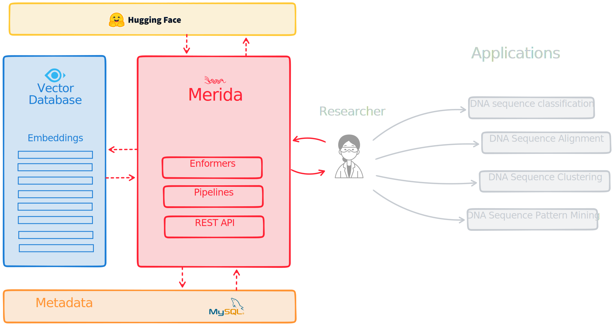

# Introduction and Motivation
[The Saudi Genome Program (SGP)](https://shgp.kacst.edu.sa/index.en.html#home) is a mega program with the ambitious goal of understanding, cataloging and solving genetic diseases that are prevalent in Saudi Arabia, and one of its main objectives is to establish advanced infrastructure in the field of genomics and bioinformatics. Moreover, biology is experiencing a Big Data revolution brought on by advances in genome sequencing technologies, leading to new challenges and opportunities in computational biology. In addition to that, just about a year ago, DeepMind announced the new [Enformer model](https://www.nature.com/articles/s41592-021-01252-x), a deep learning architecture for predicting gene expression from DNA sequence, inspired by the transformer architecture to leverage [self-attention](https://proceedings.neurips.cc/paper/2017/file/3f5ee243547dee91fbd053c1c4a845aa-Paper.pdf) processes to absorb considerably more DNA background. We expect that there will be a new wave of innovations that will come with this, similar to what happened to the field of natural language processing (NLP), where transformers have achieved substantial breakthroughs. Our beliefs that models like the [Enformer](https://huggingface.co/EleutherAI/enformer-official-rough) will experience similar patterns, and enable so many [solutions](https://www.frontiersin.org/articles/10.3389/fbioe.2020.01032/full#h5). To help accelerate the rate of innovations, our goal is to enable those who are in the field of bioinformatics by developing an end to end open source framework for analyzing data from DNA sequencing experiments utilizing the recent advances in the field of AI. The solution will utilize the technology of [vector search engines](https://github.com/milvus-io/milvus), along with an integrated metadata database, and models with simplified workflows and pipelines to make it easier for researchers to apply machine learning on a massive scale to their experiments.

